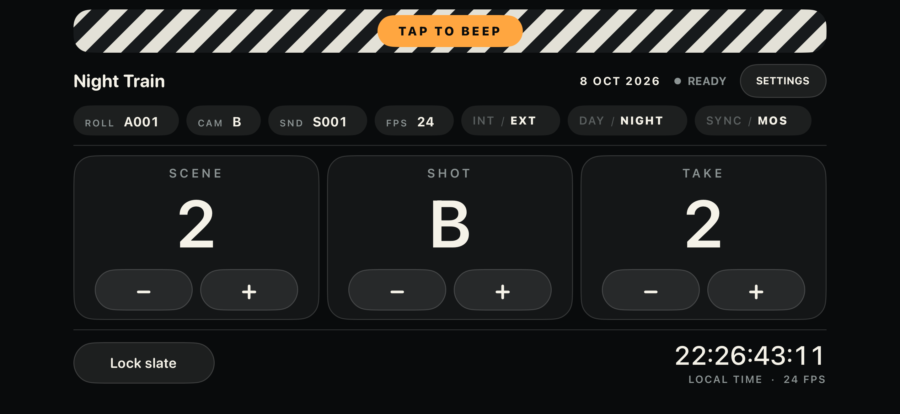
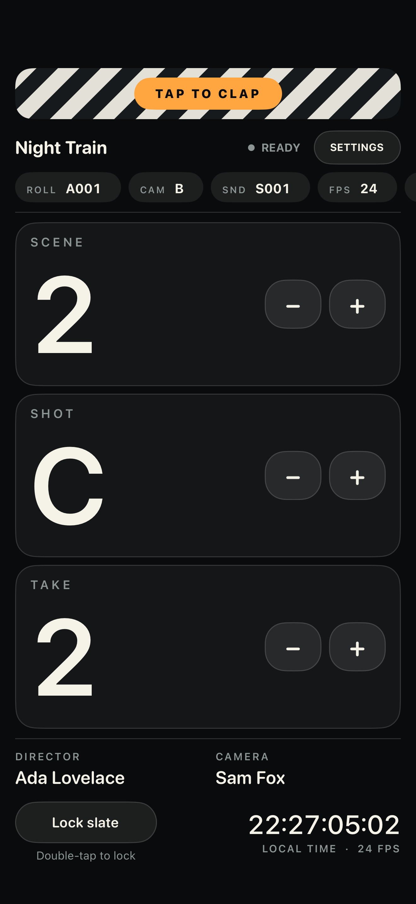
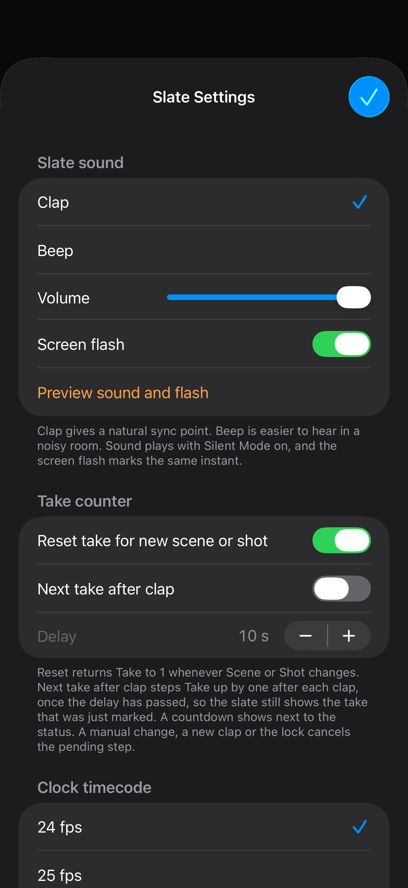

<p align="center">
  
</p>

<h1 align="center">Slate</h1>
<p align="center">A simple digital clapperboard for iPhone and iPad.</p>
<p align="center"><strong>Free. Offline. No ads, accounts, subscriptions or tracking.</strong></p>



Keep scene, shot and take visible on set. Tap the clapper bar for a clap or beep, add production details, and lock the controls between takes. Slate saves your values locally, ready for the next session.

Built with Swift and UIKit. No third-party dependencies or network requests.

[Website](https://fullyfreeapps.com/slate) · [Support](https://fullyfreeapps.com/support) · [Privacy](PRIVACY.md)

## Screenshots

<p align="center">
  
  &nbsp;
  
</p>

Real simulator captures with sample production data. The landscape view makes the counters prominent; portrait adds room for written details.

## Features

- **Scene, shot and take:** numeric scene/take controls and A–Z shot letters.
- **Production details:** title, director, camera operator, rolls, filter and notes.
- **Quick tags:** camera letter, INT/EXT, DAY/NIGHT and SYNC/MOS.
- **Clap or beep:** bundled sound, adjustable volume and optional screen flash.
- **Double-tap lock:** prevents accidental edits while keeping the clapper available. Supports accessibility activation with VoiceOver and Switch Control.
- **Take automation:** optional reset on a new scene/shot and automatic next take after a configurable 0–120 second delay.
- **Clock reference:** local time in `HH:MM:SS:FF` at 24, 25, 30, 48, 50 or 60 fps.
- **Local persistence:** counters, details and preferences restore when you reopen the app.
- **iPhone and iPad:** portrait and landscape layouts; display stays awake while Slate is active.

The clock is a visual time-of-day reference. It is **not externally synchronised timecode** and does not output timecode to recording equipment. The slate lock protects app controls, not the device's Home gestures or power button.

## Build and run

Open `Slate.xcodeproj` in Xcode and select the **Slate** scheme. There are no packages to install.

### Simulator

Choose an installed iPhone or iPad simulator and run the app. The project retains an iOS 12 deployment target for legacy local builds. Recent Xcode versions may require an iOS 15 minimum for simulator builds; use this command-line override:

```sh
export DEVELOPER_DIR=/Applications/Xcode.app/Contents/Developer
xcodebuild -project Slate.xcodeproj -scheme Slate \
  -sdk iphonesimulator -derivedDataPath build \
  IPHONEOS_DEPLOYMENT_TARGET=15.0 CODE_SIGNING_ALLOWED=NO build
```

### Your iPhone or iPad

1. Add your Apple Account in **Xcode → Settings → Accounts**.
2. Under the app target's **Signing & Capabilities**, choose your own team and a unique bundle identifier.
3. Connect and trust your device, select it as the run destination, and press **⌘R**.
4. Follow any device prompts for Developer Mode or developer trust.

This repository's bundle identifier and team ID identify the publishing account; they do not grant signing access. Use your own signing configuration for personal builds. Free Personal Team provisioning is temporary and requires periodic rebuilding; see [Apple's membership comparison](https://developer.apple.com/support/compare-memberships/).

The source retains compatibility paths for iOS 12, including the original iPad Air. Deployment to older devices depends on your Xcode/toolchain and device support. The submitted App Store build uses an **iOS 15 minimum**; that is separate from the legacy source target.

For an already configured legacy device with `ios-deploy` installed:

```sh
bash scripts/install-on-ipad.sh <device-udid>
```

Find the identifier in **Xcode → Window → Devices and Simulators**. Keep the same bundle identifier and install over the existing app to retain its local data.

## Tests and screenshots

Core tests cover counters, persistence, details, settings and clock formatting:

```sh
swift test
```

The UI tests exercise editing, locking, relaunch persistence, take automation and both orientations. To run them and export screenshot attachments:

```sh
bash scripts/screenshots.sh "iPhone 17 Pro Max" iphone
bash scripts/screenshots.sh "iPad Pro 13-inch (M5)" ipad
```

Use simulator names installed on your Mac (`xcrun simctl list devices available`). Results and screenshots are written under `build/`. The screenshot script applies the iOS 15 simulator override. **UI tests reset Slate's data in the selected simulator.**

## Project layout

| Path | Purpose |
| --- | --- |
| `Slate/` | UIKit screens, audio, assets and privacy manifest |
| `Sources/SlateCore/` | Foundation-based state, persistence and timecode logic |
| `Tests/SlateCoreTests/` | Swift Package core tests |
| `SlateUITests/` | Device/simulator UI tests and screenshot capture |
| `scripts/` | Local installation, screenshots and asset generation |
| `docs/screenshots/` | README screenshots |

The bundled clap and beep are generated locally by `scripts/generate-sounds.py`. The app icon was created for Slate. No third-party SDKs, remote media feeds or paid services are required to run the app.

## Privacy and publishing

Slate stores its data in local `UserDefaults`. It does not request microphone, camera, location, contacts or photo-library access. See [PRIVACY.md](PRIVACY.md) for details.

Slate is published by **MWD Studios Ltd** under **Fully Free Apps**. Slate remains free; this is not a pricing promise for other apps from the publisher.

Signing credentials, device recordings and private App Review correspondence are excluded from this repository. No open-source licence has been granted in this repository; public source visibility alone does not grant general reuse rights.
